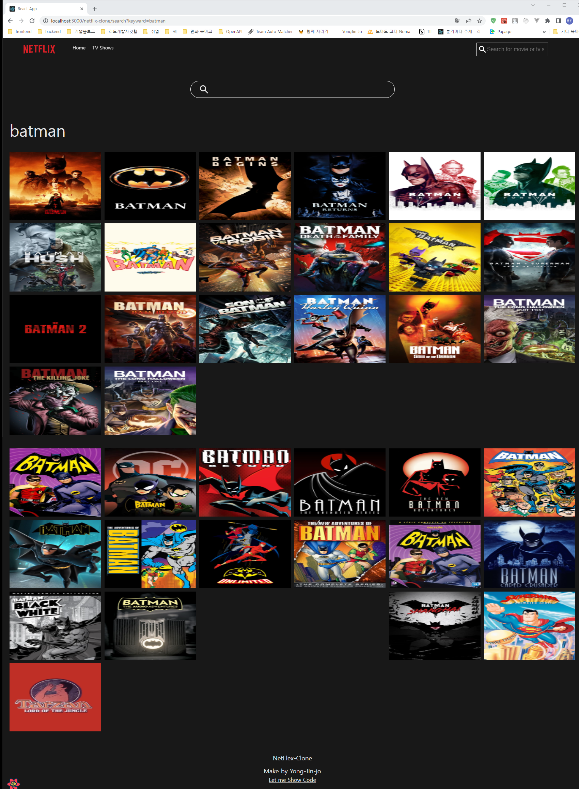
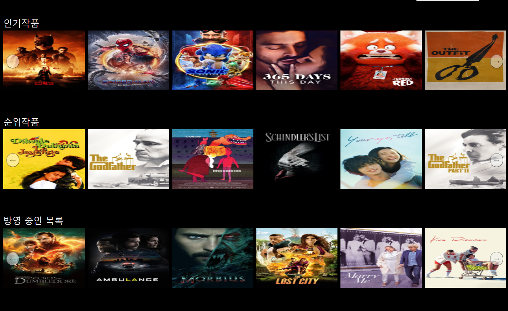
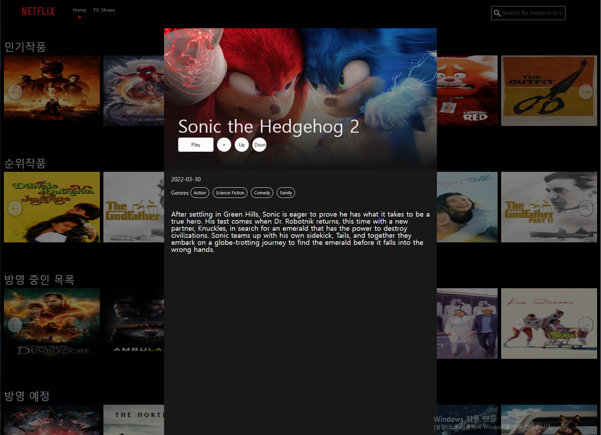

# The Movie Api 를 이용한 넷플릭스 클론 만들기

[페이지 바로가기](https://yongjin-jo.github.io/netflix-clone/)

### 사용 라이브러리
- react-query
- recoil
- styled-components
- framer-motion
- react-hook-form
  
## 주요 기능 구현

### 검색 기능/ 검색 페이지 구현
  
  TopBar 검색창에 검색어를 입력하면 이동되는 페이지 입니다.
  react-hook-form을 사용했으며 검색 데이터는 상태관리 라이브러리인 react-query로 저장됩니다.
### 슬라이더 기능 구현
  
  #### <b> 애니메이션 구현</b>
  framer-motion 라이브러리를 사용하여 구현 하였습니다. 
  framer-motion를 사용한 이유는 보통 Slider는 클릭 이벤트로 만들기는 쉽지만 클릭이 끝난후 사라는 데이터의 애니메션의 효과를 넣기 까다롭습니다.
  하지만 framer-motion를 사용하면 시작뿐만 아니라 끝 애니메이션까지 자연스러운 애니메이션 효과를 줄수 있었습니다.
  
  #### <b> 드래그 이벤트 구현</b>
  슬라이더의 마우스 드래그 이벤트를 추가할 때 더욱 간편하게 적용할 수 있었습니다.
  - recoil을 사용한 이유 
  drag상태를 관리하기 위해 recoil라이브러리를 사용했습니다. recoil을사용한 이유는 서버의 데이터를 상태관리하는 react-query를 사용했기 때문에 가볍게 클라이언트만 관리할 수 있는 rocoil을 사용해 구현 했습니다.

### 디테일 페이지 구현
  
